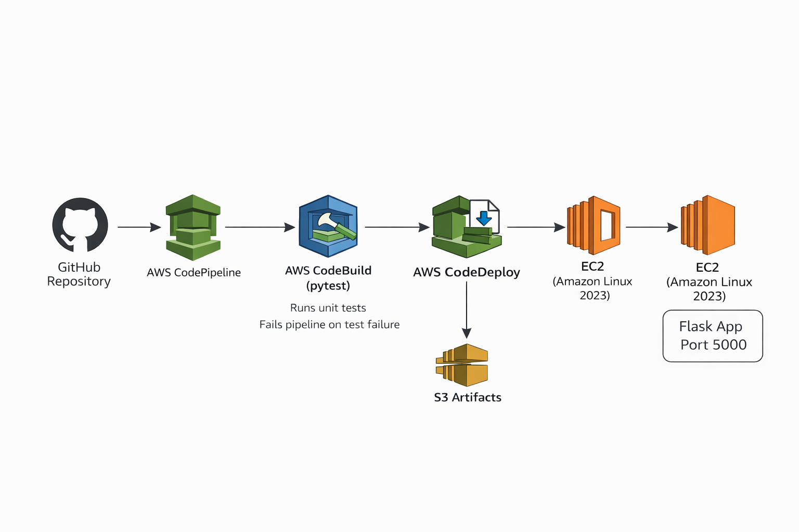

# Flask CI/CD Pipeline on AWS (End-to-End)

## Overview

This project demonstrates a complete end-to-end CI/CD pipeline using AWS native DevOps services.
A Flask application is automatically built, tested, and deployed to an EC2 instance using CodePipeline, CodeBuild, and CodeDeploy.

The goal of this project was not just deployment, but understanding real-world DevOps challenges such as:

- IAM permissions
- Linux process management
- Deployment idempotency
- Python environment bootstrapping
- Debugging “green pipelines but broken apps”

---

## Architecture



**Flow:**

1. Developer pushes code to GitHub
2. AWS CodePipeline detects changes
3. CodeBuild installs dependencies and runs pytest
4. Build artifacts are stored in S3
5. CodeDeploy deploys the application to EC2
6. Flask app runs on EC2 and is accessible via public IP

---

## Tech Stack

- AWS CodePipeline
- AWS CodeBuild
- AWS CodeDeploy
- Amazon EC2 (Amazon Linux 2023)
- Amazon S3 (artifacts)
- Python 3
- Flask
- Pytest
- GitHub

---

## CI (Continuous Integration)

- Source: GitHub
- Build tool: AWS CodeBuild
- Tests: Pytest
- Build configuration via `buildspec.yml`
- Pipeline fails if tests do not pass

---

## CD (Continuous Deployment)

- Deployment type: In-place deployment to EC2
- Tool: AWS CodeDeploy
- Lifecycle hooks:
  - BeforeInstall
  - AfterInstall
  - ApplicationStart
- Deployment scripts are idempotent to support re-deployments

---

## Key Challenges & Learnings

### 1. Pipeline Green ≠ Application Running

Even after successful deployment, the app was not accessible.
Root cause: Flask was not running due to incorrect startup scripts and Linux permissions.

### 2. CodeDeploy User vs Root Ownership

Artifacts are extracted as root, but scripts run as `ec2-user`.
Fix: Correct ownership to allow background processes to run.

### 3. Python on Amazon Linux 2023

Python is installed without pip by default.
Fix: Used `ensurepip` to bootstrap pip reliably.

### 4. Port Binding & Linux Privileges

Non-root users cannot bind to port 80.
Fix: Application runs on port 5000.

### 5. Idempotent Deployment Scripts

Scripts were rewritten to handle first-time and repeat deployments safely.

---

## How to Run Locally

```bash
pip install -r requirements.txt
python app/main.py
```
